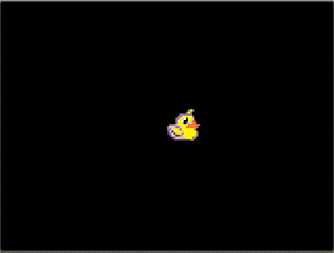

# MakeCode Arcade Guide
Resources for making awesome games with [MakeCode Arcdade](https://arcade.makecode.com/)

## Projectiles
### Firing Projectiles to Destroy Enemies

- [Video Tutorial](https://youtu.be/8U64KW0Brz0)

### Projectiles in All Directions

- [Video Tutorial](https://www.youtube.com/watch?v=uKa__AExuao&t=762s)
- [Example Code](https://arcade.makecode.com/S97473-84006-57536-03114)

### No More Spamming!
- [Delaying Projectiles Video](https://youtu.be/_mvZLLS-sjI)
- [Code Sample](https://arcade.makecode.com/S47973-66673-80358-23616)

## Tilemaps

Tilemaps are a way of creating larger levels using small image tiles. 
- [Guide](https://arcade.makecode.com/courses/csintro2/tilemap/intro). 
- [Video Tutorial](https://www.youtube.com/watch?v=_CLXzIrAGbk).
- [Random Tilemap Generator](https://arcade.makecode.com/S62817-26561-79871-75038)
 
## Animations
Animate your sprites!
- [Guide](https://learn.adafruit.com/makecode-arcade-pixel-animation/create-sprite-animation-in-makecade)

## Jump Example
Here is an example how to make a simple jump physics using velocity and acceleration.
- [Code Example](https://arcade.makecode.com/S81924-85073-02151-45494)

## MultiPlayer
- [Multiplayer Activity Guide](https://arcade.makecode.com/courses/csintro2/logic/multiplayer)
- [Multi Player Fighting Game](https://www.instructables.com/MultiplayerFighting-on-GameGo-With-Makecode-Arcade/)
- [2 Player Galga](https://www.youtube.com/watch?v=AyvYTKc15pw)

## Advanced
- [Status Bars, Hit Points, Labels](https://medium.com/kikis-corner/lives-647acce42ca8)
